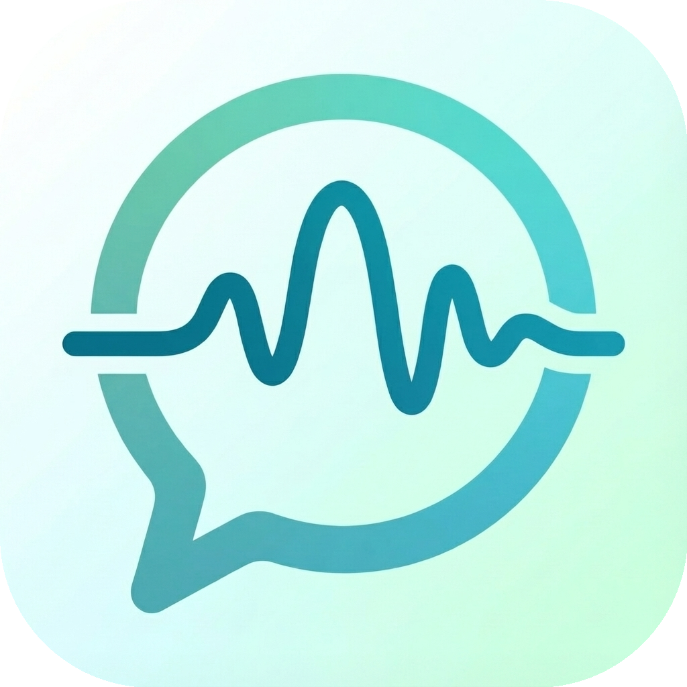
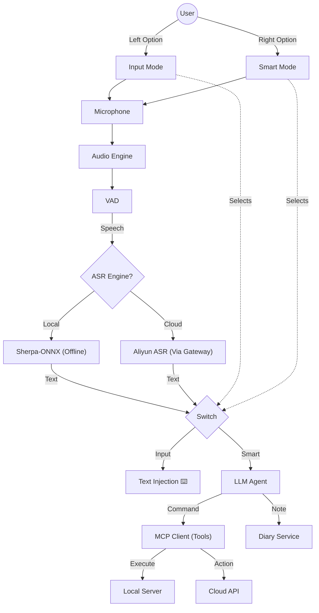
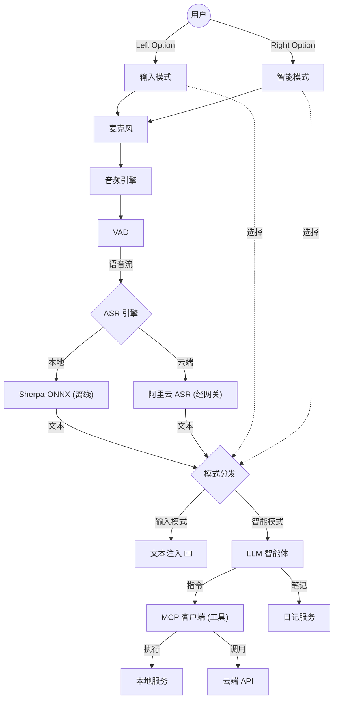

<div align="center">

  

# 子曰 SpeakOut 🎙️

  **Your Voice, Your AI Operating System.**  
  *Offline-First. Privacy-Focused. Limitless Capabilities.*

</div>

SpeakOut is not just a dictation tool. It is a **Next-Generation AI Assistant** that lives on your Mac, turning your voice into structured notes, actionable commands, and high-quality text—completely private by default.

---

## 🌟 Core Features

### 1. ⚡️ Instant Voice Input (Offline)

Press a hotkey (default: `Left Option`). Speak. Done.

- **Ultra-Low Latency**: Powered by **Sherpa-ONNX** running locally on CPU/GPU.
- **Multilingual**: Supports mixed Chinese/English recognition with high accuracy.
- **Privacy Core**: No audio leaves your device by default.

### 2. 📝 Flash Notes (Diary Mode)

Capture fleeting thoughts without context switching.

- **Hotkey**: `Right Option` (Configurable).
- **Auto-Save**: Thoughts are automatically timestamped and appended to a daily Markdown file (e.g., `2024-01-10.md`).
- **AI Correction**: Optional LLM post-processing to fix homophones and punctuation.

### 3. 🤖 MCP Agent Platform (New in v3.5)

SpeakOut acts as a "Universal Dispatcher" for the **Model Context Protocol (MCP)**.

- **Natural Language Actions**: "Add a meeting tomorrow at 2pm" -> Executes Calendar Script.
- **Extensible Skills**: Add any Python/Node.js script as a "Tool". SpeakOut handles the intent parsing.
- **HITL Security**: "Human-in-the-Loop" confirmation ensures the AI never executes dangerous commands without your approval.

### 4. 💬 Unified Chat Interface

A timeline of your digital life.

- View all your voice notes, agent execution results, and AI dialogues in one place.
- Manually archive interesting chat bubbles to your Diary.
- **Persistent History**: Conversations are saved locally and securely.

---

## 🛠️ Architecture

### The "Tri-Force" Engine

1. **Audio Native (Sherpa)**: Converts speech to text in <0.2s.
2. **LLM Router (Qwen/Aliyun)**: Analyzes text intent.
    - If "Note" -> Save to Diary.
    - If "Command" -> Construct JSON-RPC call.
3. **MCP Client**: Connects to local or remote agents via Stodio/SSE.



### Privacy by Design

- **Local First**: ASR is 100% offline.
- **Sandboxed**: App runs in macOS Sandbox, accessing only authorized directories.
- **Transparency**: You see exactly what tool is being called and with what arguments.

---

## 🚀 Getting Started

1. **Install**: Download the latest `.dmg` from Releases.
2. **Grant Permissions**: Allow Microphone and Accessibility (for text injection).
3. **Configure**:
    - **Models**: improved accuracy? Switch to Aliyun Cloud Engine (Optional).
    - **Intelligence**: Set up your LLM (Local or Remote) for smarter routing.
4. **Add Skills**:
    - Go to `Settings -> Agent Tools`.
    - Add a local script (e.g., `python3 scripts/mcp_calendar.py`).

---

## 🔧 Developer Guide

### Building from Source

```bash
# 1. Install Flutter (3.10+) & Rust (for FFI)
brew install flutter rust

# 2. Get Dependencies
flutter pub get

# 3. Build & Install
./scripts/install.sh
```

### Running Tests

```bash
flutter test test/agent_suite_test.dart
```

---

*Made with ❤️ by Leon. Powered by Flutter & Sherpa-ONNX.*

---

<div align="center">
  

# 子曰 SpeakOut 🎙️

  **你的声音，你的 AI 操作系统。**  
  *离线优先。隐私至上。无限可能。*
</div>

SpeakOut 不仅仅是一个语音输入法。它是运行在你 Mac 上的 **下一代 AI 助手**，能将你的语音转化为结构化的笔记、可执行的指令和高质量的文本——而且默认情况下完全私密。

---

## 🌟 核心功能

### 1. ⚡️ 瞬时语音输入 (离线)

按下快捷键（默认：`Left Option`）。说话。完成。

- ⚡️ **超低延迟**：由本地 CPU/GPU 运行的 **Sherpa-ONNX** 引擎驱动。
- 🌍 **混合识别**：支持中英文混合识别，准确率极高。
- 🔒 **隐私核心**：默认情况下，没有任何音频数据会离开你的设备。

### 2. 📝 闪念笔记 (日记模式)

无需切换上下文即可捕捉转瞬即逝的想法。

- ⌨️ **快捷键**：`Right Option`（可配置）。
- 💾 **自动保存**：想法会自动打上时间戳并追加到每日 Markdown 文件中（例如 `2024-01-10.md`）。
- ✨ **AI 纠错**：可选的 LLM 后处理，用于修复同音字和标点符号。

### 3. 🤖 MCP 智能代理平台 (v3.5 新增)

SpeakOut 充当 **Model Context Protocol (MCP)** 的“通用调度器”。

- 🗣️ **自然语言操作**：“明天下午2点添加一个会议” -> 执行日历脚本。
- 🔌 **可扩展技能**：将任何 Python/Node.js 脚本添加为“工具”。SpeakOut 负责意图解析。
- 🛡️ **安全确认 (HITL)**：“人机交互”确认机制确保 AI 在未经你批准的情况下绝不执行危险命令。

### 4. 💬 统一聊天界面

你数字生活的时间轴。

- 👁️ 在一个地方查看所有的语音笔记、Agent 执行结果和 AI 对话。
- 📂 手动将有趣的聊天气泡归档到你的日记中。
- 🕰️ **持久化历史**：对话记录安全地保存在本地。

---

## 🛠️ 架构设计

### "三位一体" 引擎 (The "Tri-Force" Engine)

1. **音频原生 (Sherpa)**：在 <0.2秒内将语音转换为文本。
2. **LLM 路由 (Qwen/Aliyun)**：分析文本意图。
    - 如果是“笔记” -> 保存到日记。
    - 如果是“命令” -> 构造 JSON-RPC 调用。
3. **MCP 客户端**：通过 Stdio/SSE 模接本地或远程代理。



### 隐私设计

- **本地优先**：ASR 100% 离线运行。
- **沙盒运行**：App 在 macOS Sandbox 中运行，仅访问授权的目录。
- **透明度**：你可以确切地看到正在调用什么工具以及使用什么参数。

---

## 🚀 快速入门

1. **安装**：从 Releases 下载最新的 `.dmg`。
2. **授权**：允许麦克风和辅助功能（用于文本注入）。
3. **配置**：
    - **模型**：想要更高的准确率？切换到阿里云云端引擎（可选）。
    - **智能**：设置你的 LLM（本地或远程）以实现更智能的路由。
4. **添加技能**：
    -前往 `设置 -> Agent 工具`。
    - 添加一个本地脚本（例如 `python3 scripts/mcp_calendar.py`）。

---

## 🔧 开发者指南

### 源码构建

```bash
# 1. 安装 Flutter (3.10+) & Rust (用于 FFI)
brew install flutter rust

# 2. 获取依赖
flutter pub get

# 3. 构建与安装
./scripts/install.sh
```

### 运行测试

```bash
flutter test test/agent_suite_test.dart
```
