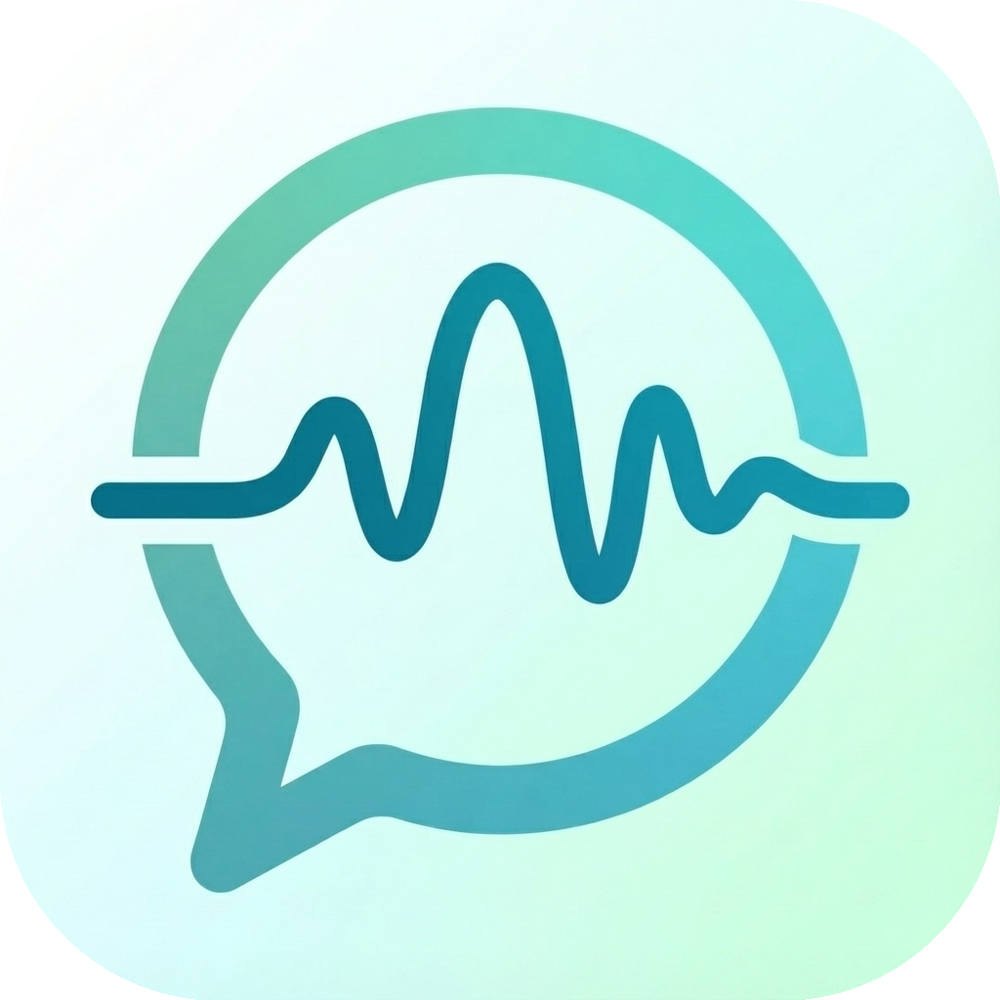
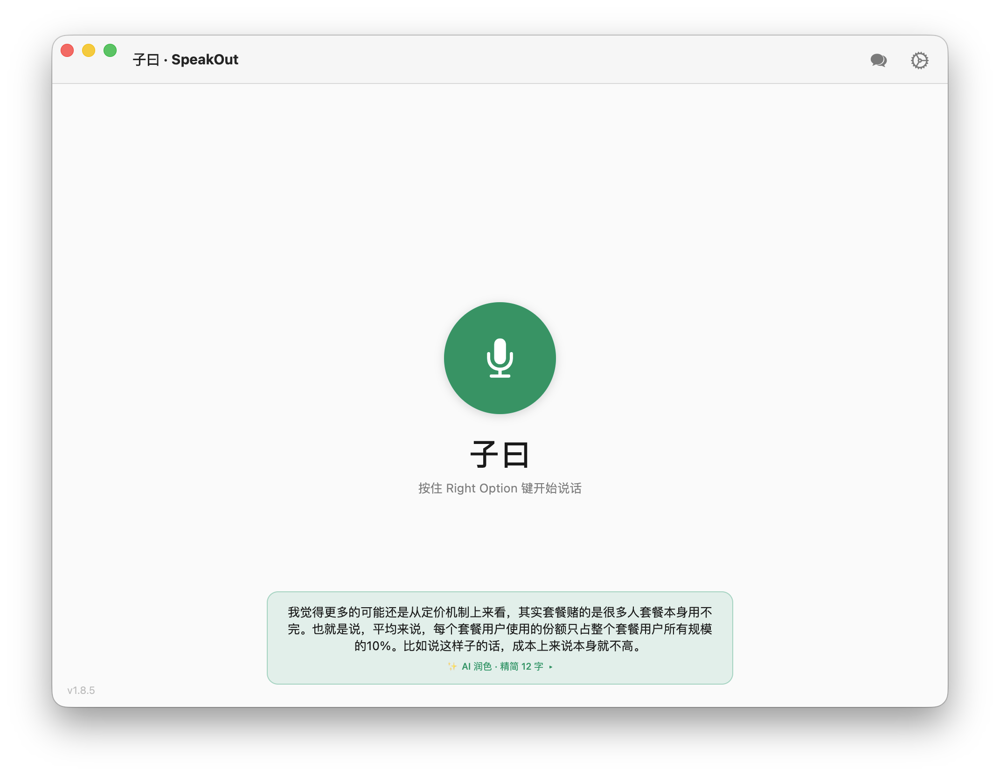
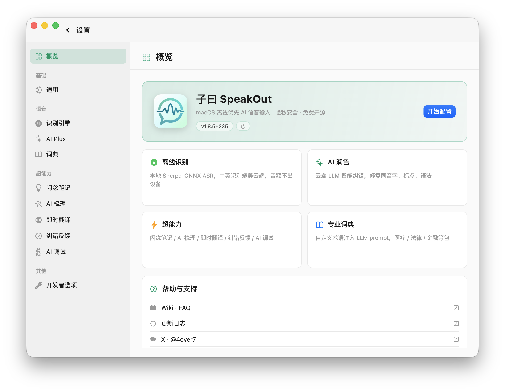
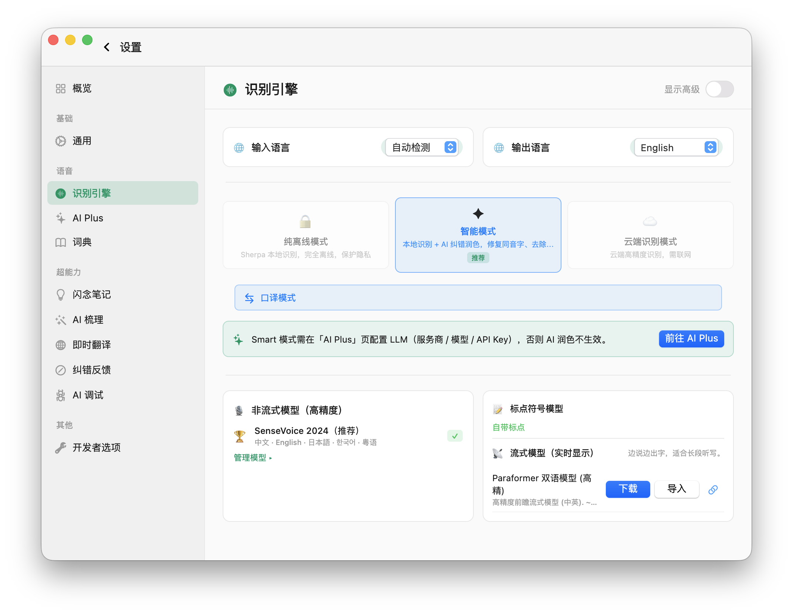
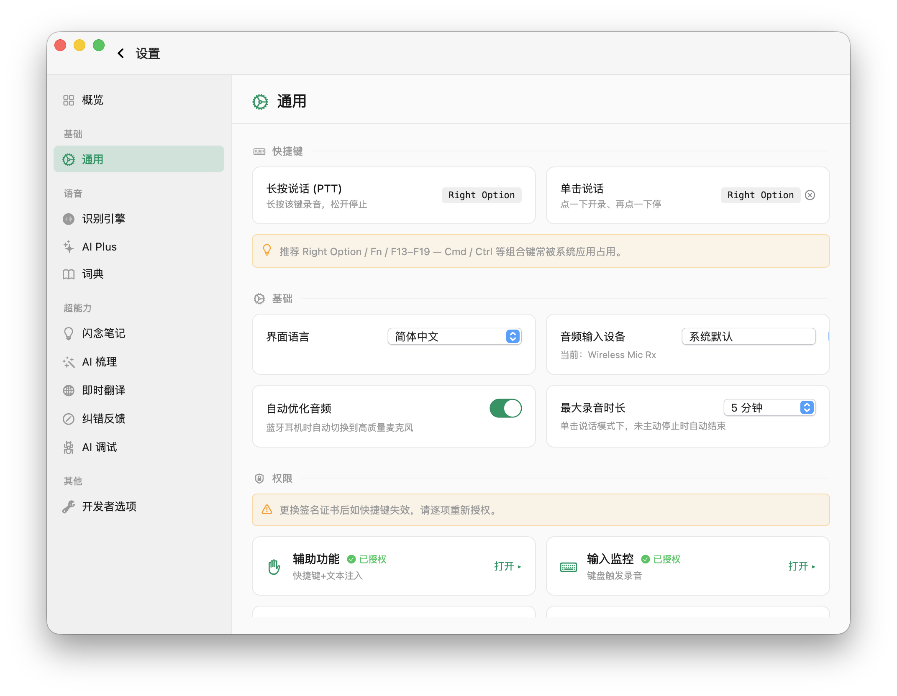

<div align="center">

  

# 子曰 SpeakOut

  **Offline-First AI Voice Input for macOS**
  *Hold a key. Speak. Auto-type.*

  [Download](https://github.com/4over7/SpeakOut/releases/latest) · [Wiki](https://github.com/4over7/SpeakOut/wiki) · [Changelog](CHANGELOG.md)

  
  
  
  

  <br/>

  

</div>

---

## What is SpeakOut?

A macOS desktop app that turns your voice into text — offline by default, with optional cloud enhancement. Press a hotkey, speak naturally, and text appears at your cursor. Supports 11 languages, real-time translation, and AI-powered text polishing.

**Works 100% offline with production-quality results.** No account, no API key, no internet required. Just install, download a model, and start speaking. Cloud features (AI polish, translation, cloud ASR) are optional enhancements — the core voice input experience is fully local.

**Core principles**: privacy first (audio never leaves your device in offline mode), low latency (sub-second response), and zero configuration (works out of the box).

---

## Features

### Voice Input

Two working modes, plus **AI Polish as an independent toggle** that can be layered on either one:

| | Offline Mode | Cloud Mode |
|---|---|---|
| **ASR Engine** | Sherpa-ONNX (local) | Cloud ASR (Groq, DashScope, etc.) |
| **Privacy** | 100% offline | Audio sent to cloud |
| **Latency** | Fastest | Depends on network |
| **+ AI Polish** | ASR local, LLM via cloud (+0.5~1s) | LLM correction + translation (+0.5~1s) |

- **8 Offline Models** — SenseVoice, Paraformer, Whisper Large-v3, FireRedASR, and more
- **Two Trigger Modes** — Hold to Speak (PTT) or Tap to Toggle
- **Streaming & Offline** — Real-time subtitles while speaking, or higher accuracy after release

### 11 Languages + Translation

| Languages | Input | Output | Translation |
|-----------|-------|--------|-------------|
| Chinese, English, Japanese, Korean, Cantonese | All modes | All modes | — |
| Spanish, French, German, Russian, Portuguese | Whisper / Cloud | With AI Polish | Via LLM |

- **Auto-detect** — Let the model detect what language you're speaking
- **Translation Mode** — Set different input/output languages (e.g., speak Chinese → output English). Requires AI Polish to be enabled.
- **Script Control** — Choose Simplified or Traditional Chinese output

### Cloud ASR (6 Providers)

| Provider | Protocol | Highlights |
|----------|----------|------------|
| **DashScope** (Aliyun) | WebSocket | Paraformer realtime, Chinese optimized |
| **Groq** | REST (Whisper) | Fast, 99 languages |
| **OpenAI** | REST (Whisper/GPT-4o) | Most accurate multilingual |
| **Volcengine** (ByteDance) | WebSocket (binary) | Seed-ASR, highest Chinese accuracy |
| **iFlytek** | WebSocket | 202 dialects |
| **Tencent Cloud** | WebSocket | 5h/month free |

### AI Polish (optional toggle)

LLM post-processing: fix homophones, remove filler words, translate, enforce output language.

- **12 LLM Providers** — DashScope, DeepSeek, Volcengine, OpenAI, Anthropic, Zhipu, Kimi, MiniMax, Gemini, iFlytek, Groq, Ollama (local)
- **Professional Vocabulary** — Industry dictionaries (Tech/Medical/Legal/Finance/Education) + personal dictionary
- **Typewriter Mode** (Alpha) — Stream LLM output character by character to cursor

### ⚡ Superpowers

Hotkey-driven productivity features on top of voice input:

- **Flash Notes** — Dedicated hotkey, speak and auto-save as timestamped Markdown to any folder
- **AI Organize** — Select any text, press hotkey, LLM restructures logic and appends below the original (keeps source intact)
- **Instant Translation** — Speak source language, output target language in real time (works with any AI Polish LLM)

### Smart Audio

- **Bluetooth Detection** — Auto-detects headset connect/disconnect
- **Device Selection** — Choose preferred mic in settings
- **Pre-segmentation** — 3s pause triggers background decoding, minimizing final wait on stop

---

## Glimpse

Settings page after the v1.8 redesign — sidebar navigation, every feature has its own page, per-page Advanced toggle.

<p align="center">
  
  
  
</p>
<p align="center"><sub>Overview · Recognition Engine · General + Permissions</sub></p>

<p align="center">
  
</p>
<p align="center"><sub>Floating recording pill — appears anywhere on screen while you speak</sub></p>

---

## Install

1. Download `SpeakOut.dmg` from [Releases](https://github.com/4over7/SpeakOut/releases/latest)
2. Drag to `/Applications` (DMG is signed with Developer ID + Apple Notarized — no Gatekeeper warning, no `xattr` needed)
3. Grant permissions: **Input Monitoring**, **Accessibility**, **Microphone**
4. Follow the onboarding wizard — **the default model ships inside the app, so you can speak right away**

### System Requirements

- macOS 13+ (Ventura or later)
- **Default model is bundled — no download needed on first launch.** Optional larger models (Whisper / FireRedASR) download on demand, up to ~1.4GB

---

## Offline Models

### Streaming (Real-time subtitles)

| Model | Languages | Size |
|-------|-----------|------|
| Paraformer Bilingual Streaming | Zh/En | ~1GB |

### Non-streaming (Higher accuracy)

| Model | Languages | Size | Notes |
|-------|-----------|------|-------|
| **SenseVoice 2024** | Zh/En/Ja/Ko/Yue | ~228MB | Default, built-in punctuation |
| Paraformer Offline | Zh/En | ~217MB | Fastest decoding (70x realtime) |
| FireRedASR v2 CTC | Zh/En + dialects | ~496MB | XiaoHongShu, dialect coverage |
| SenseVoice + FunASR Nano | Zh/En/Ja | ~179MB | Combined encoder/decoder, compact |
| SenseVoice 2025 | Zh/En/Ja/Ko/Yue | ~158MB | Cantonese enhanced (21.8k hrs) |
| Paraformer Dialect 2025 | Zh/En + Sichuan/Chongqing | ~218MB | Mandarin dialect support |
| Whisper Turbo | 99 languages | ~538MB | OpenAI, best multilingual |
| Dolphin Base | Multilingual | ~77MB | Ultra-light CTC |

---

## Architecture

```
Hotkey → native_input.m (CGEventTap)
  → C Ring Buffer (16kHz PCM)
  → CoreEngine FFI polling
  → ASR (8 offline models / 6 cloud providers)
  → LLM polish + translation (optional, 12 providers)
  → Clipboard paste to active app
```

| Layer | Path | Description |
|-------|------|-------------|
| Engine | `lib/engine/` | CoreEngine, ASR providers, model management |
| Service | `lib/services/` | Config, LLM, billing, diary, audio devices |
| UI | `lib/ui/` | macOS-native UI (macos_ui), settings, overlay |
| Native | `native_lib/` | Objective-C: CGEventTap + AudioQueue ring buffer |
| Gateway | `gateway/` | Cloudflare Workers (Hono): license, billing, version check |

**Codebase**: ~31,500 lines of Dart across 85 files, plus ~1,800 lines of Objective-C.

---

## Build from Source

```bash
flutter pub get          # Dependencies
flutter analyze          # Static analysis (0 issues)
flutter test             # Run tests
flutter build macos --release  # Build
./scripts/install.sh     # Install to /Applications
./scripts/create_styled_dmg.sh  # Create DMG

# Native library (after modifying native_input.m)
cd native_lib && clang -dynamiclib -framework Cocoa -framework Carbon \
  -framework AVFoundation -framework AudioToolbox -framework CoreAudio \
  -framework Accelerate -o libnative_input.dylib native_input.m -fobjc-arc
```

---

## Security

- **Offline Mode** — Audio never leaves your device
- **Credentials** — API keys are stored locally in SharedPreferences and are never included in configuration or account exports
- **Logging** — User speech content never logged by default; developer mode logs may include input/output text for debugging
- **Independent Review** — Passed 4 rounds of independent third-party security review

---

## License

Copyright © 2025-2026 Leon Xu (云梦泽). All Rights Reserved.

See [LICENSE](./LICENSE) for full terms. Source code is publicly visible for
transparency, user trust, and security review — this is **not** an open-source
license.

---

<div align="center">

# 子曰 SpeakOut

  **macOS 离线优先 AI 语音输入**
  *按住按键，说话，自动输入。*

  [下载最新版](https://github.com/4over7/SpeakOut/releases/latest) · [Wiki](https://github.com/4over7/SpeakOut/wiki) · [更新日志](CHANGELOG.md)

</div>

---

## 功能亮点

### 语音输入
- **完全离线可用** — 无需账号、无需联网、无需 API Key，安装即用。9 款本地模型（1 流式 + 8 非流式）基于 [Sherpa-ONNX](https://github.com/k2-fsa/sherpa-onnx)，中英识别准确率媲美云端，音频不出设备
- **两种工作模式 + 独立 AI 润色开关** — 本地（隐私优先）/ 云端（高精度）；AI 润色可叠加在任一模式上
- **两种触发方式** — 按住说话（PTT）或单击切换（Toggle）；PTT 和 Toggle 可共用一个键
- **预分段识别** — 录音中检测到 3 秒停顿自动后台解码，停止时只等最后一段，显著减少等待

### 11 种语言 + 口译
- 中英日韩粤 + 西法德俄葡，支持输入/输出自动检测
- **口译模式** — 输入中文→输出英文等任意组合，LLM 自动翻译（需开启 AI 润色）

### ⚡ 超能力（热键驱动）
- **闪念笔记** — 独立热键，语音直接保存为 Markdown，按天归档到自定义目录
- **AI 梳理** — 选中文字按快捷键，LLM 深度重组逻辑结构并追加在原文下一行
- **即时翻译** — 按住说话自动翻译为目标语言，不影响正常录音

### 云端服务（可选增强）
- **6 家云端 ASR** — 阿里云百炼（DashScope 实时）、Groq、OpenAI、火山引擎、讯飞、腾讯云
- **12 家 LLM** — 百炼、DeepSeek、豆包、OpenAI、Claude、智谱、Kimi、MiniMax、Gemini、讯飞、Groq、Ollama 本地
- **服务商预置** — 新用户打开云账户即可看到完整列表，点击配置即用
- **账户导入/导出** — 跨设备迁移账户结构，JSON 格式；不含凭证值，导入后需重新填写

### 专业词汇 & 安全
- **行业词典 + 个人词库** — 术语注入 LLM 实现领域感知
- **API 密钥本地存储** — SharedPreferences，不上云、不同步；配置与账户导出均不包含密钥值
- **签名公证** — Developer ID 签名 + Apple 公证，下载双击即用，无 Gatekeeper 警告

## 产品截图

v1.8 设置页全面重构 — sidebar 导航，每个功能独立页面，每页支持高级开关。

<p align="center">
  
  
  
</p>
<p align="center"><sub>概览 · 识别引擎 · 通用（含权限授权状态徽标）</sub></p>

<p align="center">
  
</p>
<p align="center"><sub>录音悬浮窗 — 说话时悬浮在屏幕任意位置</sub></p>

## 安装

1. 从 [Releases](https://github.com/4over7/SpeakOut/releases/latest) 下载 `SpeakOut.dmg`
2. 拖到 `/Applications`（DMG 已 Developer ID 签名 + Apple 公证，无需 `xattr -cr`，双击即用）
3. 授权：**输入监控**、**辅助功能**、**麦克风**
4. 按引导完成即可使用 —— **默认模型已随包内置，无需下载，装完就能说第一句话**

**系统要求**：macOS 13+。默认模型已内置，无需额外下载；如需 Whisper / FireRedASR 等更大模型可按需下载（最多约 1.4GB）

---

## Contact

<a href="https://x.com/4over7"></a>


